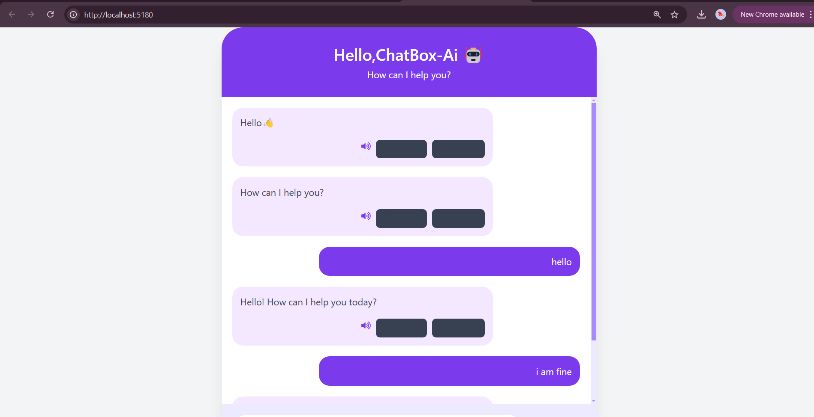
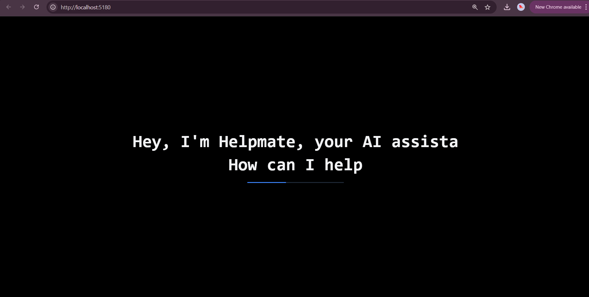

# Chatbox-AI 🤖

ChatBox-AI is a modern AI-powered chatbot interface built with React, Tailwind CSS, and Google's Gemini API. It allows users to interact with an AI assistant in a sleek, scrollable chat UI , and  It provides real-time responses and a smooth user experience with animations and responsive design.


<p align="center">
  
   
 
</p>

---

## 🚀 Live Demo
👉 [Click here to try ChatBox-AI](https://chatbox-ai-eosin.vercel.app/)
    [Github]( https://github.com/arpiztech/CHATBOX-AI/)


---
## 📂 Project Features

- ✨ Beautiful chat interface using Tailwind CSS
- 💬 Dynamic typing animation and response display
- 🧠 Uses Gemini AI API for generating intelligent replies
- 🌓 Light and dark mode support
- 📱 Responsive for mobile and desktop
- 🔒 Environment variables for secure API key usage
- - 💬 Stylish Chat UI
 - - 👤 User & Bot avatars

---

## 🛠️ Tech Stack

- **Frontend**: React, Tailwind CSS, Axios
- **Backend/API**: Google Gemini Generative Language API
- **Deployment**: Vercel
- **Icons**: React Icons

---
## ⚙️ Getting Started (For Developers)

1. **Clone the repo**
   ```bash
   git clone https://github.com/arpiztech/CHATBOX-AI.git
   cd CHATBOX-AI
2. Install dependencies
   
npm install

4. Set up API key

Create a .env file in the root folder.
Add:
VITE_GEMINI_API_KEY=your_google_gemini_api_key


4. Run the development server
   
npm run dev


🧠 Gemini API Setup
To get your Gemini API key:

Go to Google AI Studio

Create a new project and enable the Generative Language API

Get your API key from Google Cloud Console

📸 Screenshots (image1.png/) (image2.png/)

📝 License
This project is licensed under the MIT License.

🙋‍♀️ Author
ArpizTech

GitHub: @arpiztech

Project: ChatBox-AI

---
 Push changes:

git add README.md public/assets/
git commit -m "Added README with banner and screenshots"
git push


